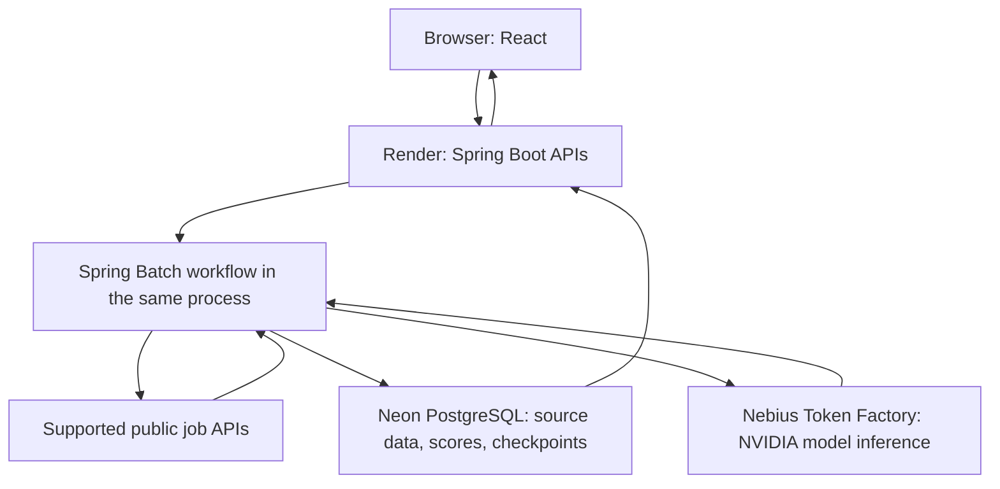

# JobLens — judge guide and video plan

## Try the demo

1. Open https://joblens-demo.onrender.com and wait for any initial startup to complete.
2. Use a synthetic or redacted PDF/DOC/DOCX résumé. The current anonymous demo is not intended for
   sensitive personal documents.
3. Review the extracted skills and roles, select a supported search market, and activate the profile.
4. Follow the dashboard's run status. Avoid submitting another search while one is running.
5. Inspect ranked results. The updated React cards expose score provenance and expandable fit summaries.
   This display is locally verified and must be deployed before recording. NVIDIA scoring is bounded by runtime limits;
   not every job receives a model score. Deterministic fallback is an intended behaviour.
6. Save a job and open Applications to inspect lifecycle controls. Saving a job does not send an
   application to an employer.

If a search request times out, return to the dashboard and inspect the recorded run before retrying.
Provider outages, quotas and cold starts can affect the live demo. Do not promise instantaneous
searches or universal source coverage.

## Video storyboard — target 2 minutes 45 seconds

Record real application interaction. Use cuts to omit waiting, with an on-screen label identifying
time compression. Never present fixture results or cached scores as a fresh model response.
Keep tokens, host dashboards, personal tabs and credentials out of the recording.

| Time | Screen | Narration |
| --- | --- | --- |
| 0:00–0:20 | JobLens dashboard/title | “JobLens helps job seekers move from a résumé to an explainable shortlist and an organized application workflow. The aim is to show why a role fits, not just return more listings.” |
| 0:20–0:45 | Upload and review a synthetic résumé | “The résumé becomes a draft. I review the extracted skills, choose the roles and markets I want, and explicitly activate my profile.” |
| 0:45–1:05 | Search status and provider evidence | “JobLens discovers public postings through supported APIs, preserves source evidence, normalizes jobs and detects duplicates. Spring Batch records progress so the workflow can be inspected and restarted.” |
| 1:05–1:40 | A verified NVIDIA-scored result and expanded explanation | “Deterministic rules create a bounded shortlist. An NVIDIA Nemotron model running through Nebius Token Factory then supplies a validated fit score and explanation. The dashboard identifies the scoring source and provides an expandable explanation. Invalid responses or unavailable inference fall back to the explainable baseline.” |
| 1:40–2:00 | Score provenance/cache evidence, then architecture | “Scores are cached against the candidate profile, job content, model and prompt versions. Our live acceptance verified that repeating unchanged scoring reused the result without another provider attempt. React and Spring Boot run on Render, PostgreSQL runs on Neon, and model inference runs on Nebius.” |
| 2:00–2:25 | Save a job; application stage and follow-up | “The same workspace keeps promising jobs, application stages and follow-ups together. Saving a result here tracks my workflow; it does not automatically apply to an employer.” |
| 2:25–2:45 | Dashboard and project links | “JobLens V1 demonstrates explainable job intelligence using hosted NVIDIA inference. Next we will evaluate ranking quality on reviewed examples and strengthen run feedback, identity and privacy. The repository includes setup instructions and verification evidence.” |

Run 50 provides live query-planning evidence. After deploying HACKATHON-UI-01, expand Why this
query on the Adzuna source card to show its AI-assisted planning label and explain that the model retained the existing query because prior results supported
it. Do not claim improved relevance from this example. Keep the total below three minutes and
provide English narration or translation.

## Architecture for the submission

Query planning and final ranking are separately controlled; baseline scoring remains available.
This diagram shows the existing deployment, not an always-on or highly available production design.

## Recording and publishing checklist

- [x] Implement and locally verify React evidence display (HACKATHON-UI-01).
- [ ] Deploy the display and verify the public demo.
- [ ] Rehearse in a clean synthetic browser workspace.
- [ ] Verify the model-scored example before recording.
- [ ] Capture real screens and record narration; trim to under three minutes.
- [ ] Upload to YouTube as **Public**, then verify playback without signing in.
- [ ] Add the video URL to Devpost and review the full entry before final submission.

